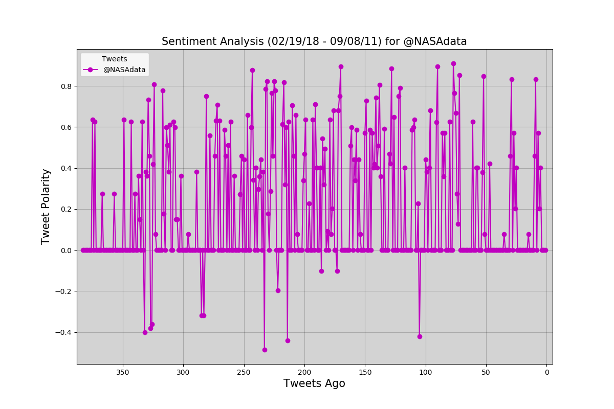

# DataPlotBot
This is a Twitter Bot that sends out visualized sentiment analysis of a Twitter account's recent tweets. The bot receives tweets via mentions and in turn performs sentiment analysis on the twitter account(s) specified in the mention 

For example, when a user tweets, __"@DataPlotBot Analyze: @CNN,"__ it will trigger a sentiment analysis on the CNN twitter feed. A plot from the sentiment analysis is then tweeted to the PlotBot5 twitter feed. 

## Bot Considerations:

* The bot scans your account every __five minutes__ for mentions.
* The bot pulls __500__ most recent tweets to analyze for each incoming request.
* The bot prevents abuse by analyzing __only__ Twitter accounts that have not previously been analyzed.
* The bot mentions the Twitter account name of the requesting user in its analysis twitter post.
* The bot performs analysis on all twitter ids in the mention

## APIs used

The following APIs were used for this application:

* __tweepy__ : This api was used to get the needed information for twitter and post to the twitter page
* __pandas__ : This api was used to assist in organizing the data for the analysis into a data frame for wasy plotting
* __matplotlib__ : This is the plotting api used to generate all the scatter plots for the analysis
* __vaderSentiment__: This api was used to generate the sentiment analysis for the twitter texts

## Sample Analysis

## Twitter Screen Shots

